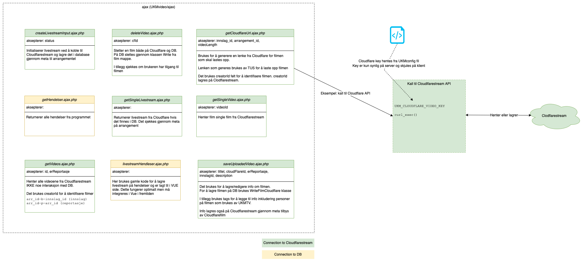
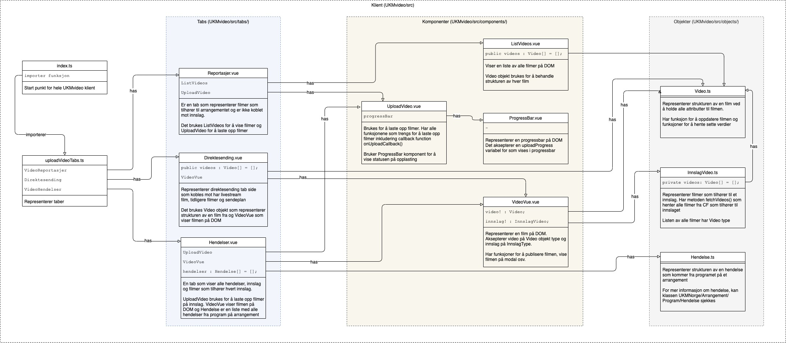

# UKMvideo

## Beskrivelse
UKMvideo brukes **Cloudflare Stream** for å laste opp / hente filmer. I tillegg brukes **Cloudflare Stream** for direktesending.

## API i plugin og kobling mot Cloudflare Stream
Det tilbys API internt i plugin for å snakke med Cloudflare Stream. I tillegg brukes brukes dette API-et for å snakke med DB

Det brukes key for å få kommunikasjon med Cloudflare Stream og key-en er beskyttet i UKMconfig fil

Diagrammet under viser filer på ajax mappe og hvordan kobling mot Cloudflare Stream utføres

## Klient side struktur
Det brukes Webpack, Vue og Typescript på klient. Klienten snakker med backend gjennom API (ajax mappe).

Klassediagrammet under viser strukturen av filer/klasser og grupperinger. 
* **Tabs** (UKMvideo/src/tabs/) har Vue-klasser som definerer tabs som vises på DOM. 
* **Komponenter** (UKMvideo/src/components/) har Vue-klasser som inneholder komponenter som kan gjennbrukes. 
* **Objekter** (UKMvideo/src/components/) har Typescript-klasser som representerer filmer eller andre objekter.

